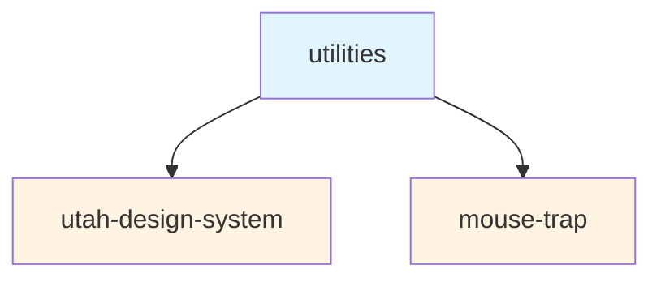

# Kitchen Sink

[](https://github.com/agrc/kitchen-sink/actions/workflows/release.yml)

[](https://www.npmjs.com/package/@ugrc/utah-design-system)
[](https://www.npmjs.com/package/@ugrc/mouse-trap)
[](https://www.npmjs.com/package/@ugrc/utilities)
[](https://www.npmjs.com/package/@ugrc/esri-theme-toggle)
[](https://www.npmjs.com/package/@ugrc/eslint-config)
[](https://www.npmjs.com/package/@ugrc/tailwind-preset)
[](https://www.npmjs.com/package/@ugrc/tsconfigs)

A monorepo containing UGRC's reusable React components, utilities, and configuration packages.

## Preview

The [storybook files](https://ut-dts-agrc-kitchen-sink-prod.web.app/) are published to the web to view and learn about the components.

## Packages

This monorepo contains the following packages:

### [@ugrc/utah-design-system](./packages/utah-design-system)

A collection of React components implementing the [Utah Design System](https://designsystem.utah.gov). Includes spatial components for maps, geocoding, and location services built with React Aria and ArcGIS.

```bash
npm install @ugrc/utah-design-system
```

### [@ugrc/mouse-trap](./packages/mouse-trap)

A React component that displays cursor coordinates while hovering over an ArcGIS map. Supports multiple coordinate systems and projections.

```bash
npm install @ugrc/mouse-trap
```

### [@ugrc/utilities](./packages/utilities)

Shared utility functions and React hooks for UGRC projects, including helpers for working with ArcGIS maps and spatial data.

```bash
npm install @ugrc/utilities
```

### [@ugrc/esri-theme-toggle](./packages/esri-theme-toggle)

Automatically switches between Esri CSS themes based on the browser's preferred color scheme (light/dark mode).

```bash
npm install @ugrc/esri-theme-toggle
```

### [@ugrc/eslint-config](./packages/eslint-config)

Shared ESLint configurations for UGRC projects with support for React, TypeScript, and Storybook.

```bash
npm install --save-dev @ugrc/eslint-config
```

### [@ugrc/tailwind-preset](./packages/tailwind-preset)

The default Tailwind CSS preset for UGRC projects with support for React Aria Components.

```bash
npm install --save-dev @ugrc/tailwind-preset
```

### [@ugrc/tsconfigs](./packages/tsconfigs)

Shared TypeScript configurations for UGRC projects, including browser and Vite-specific configurations.

```bash
npm install --save-dev @ugrc/tsconfigs
```

## Package Dependencies

Some packages in this monorepo depend on each other:



- **`@ugrc/utah-design-system`** depends on **`@ugrc/utilities`** for shared utility functions and React hooks
- **`@ugrc/mouse-trap`** depends on **`@ugrc/utilities`** for coordinate projection utilities

The remaining packages (`eslint-config`, `esri-theme-toggle`, `tailwind-preset`, `tsconfigs`) are standalone and have no internal dependencies.

## Development

1. Build the packages
   1. `npm run build`
2. View the stories
   1. `npm run storybook`

### Conventional Commits

Please use [conventional commits](https://www.conventionalcommits.org) with the following scopes:

- `monorepo`
- `design-system`
- `eslint-config`
- `layer-selector`
- `mouse-trap`
- `tailwind`
- `tsconfigs`
- `utilities`

Within the utah design system use the lower snake case component name

- `button`
- `tag-group`
- `hooks`

or if general package updates use

- `uds`

### NPM Linking

To test these packages in other local projects, first run `npm link -workspaces` from the root of this project. Then run `npm link @ugrc/utah-design-system` from the root of your test project. Please note that you need to run `npm link` for all of the packages at the same time or previous ones will be removed.

Then run `npm run build:watch --workspace packages/sherlock` to automatically build the package any time a file is saved.

## Dependencies

To continue with tailwind version 3 support

- tailwind-merge is pinned at version `2.6.*`
- tailwind-variants is pinned at version `0.3.*`

## Attribution

This project was developed with the assistance of [GitHub Copilot](https://github.com/features/copilot).
