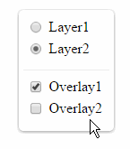

## Usage

```
npm install @agrc/layer-selector
```

 - [ArcGISTiledMapServiceLayers](./tests/example-mapserv-basemaps.html)
 - [esri basemap](./tests/example-placement-over-esri-map.html)
 - [Happy path Web Mercator](./tests/example-happy-path-tokens.html) * _requires quad token auth_
 - [Linked Overlays](./tests/example-linked-overlays.html)
 - [Custom LODS](./tests/example-custom-lods.html)
